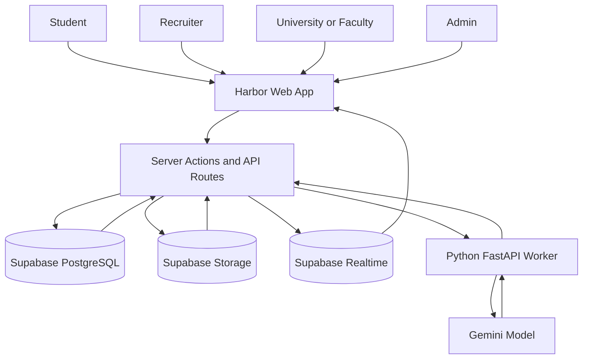
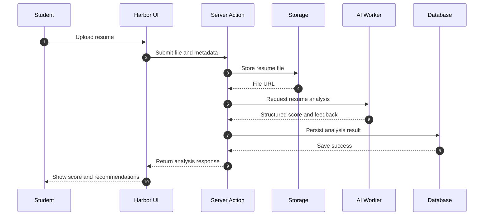
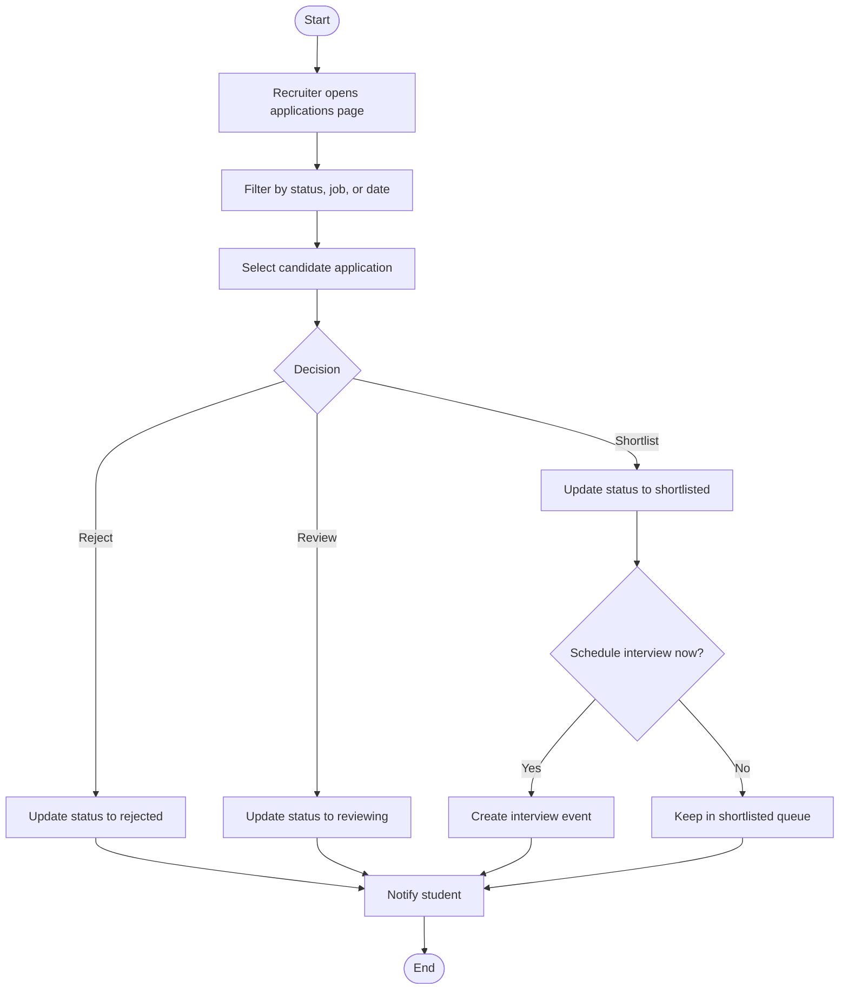
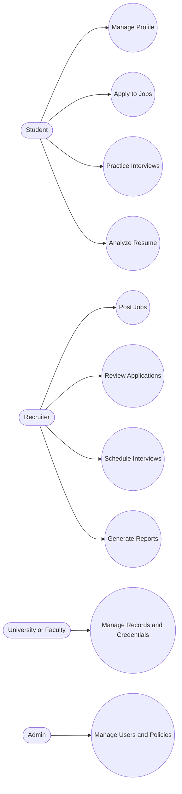
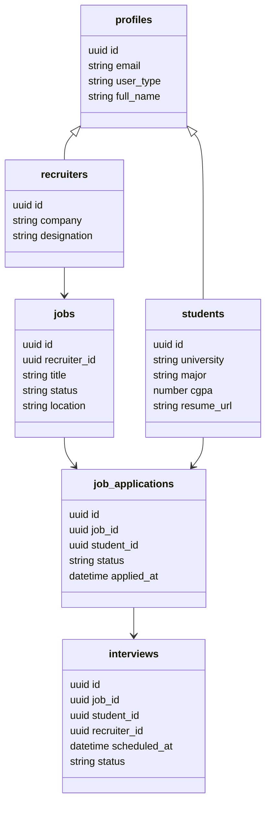

# Harbor: Unified Employability and Recruitment Platform

## Abstract

Harbor is a full-stack, role-driven platform built to connect student readiness, university academic workflows, and recruiter hiring operations in one integrated system. Conventional campus placement ecosystems are fragmented: students manage resumes and interview practice in isolated tools, recruiters track candidates across disconnected portals, and universities maintain records without direct employability linkage. Harbor addresses this gap through a centralized architecture that combines profile intelligence, job pipelines, credential workflows, AI-assisted resume analysis, and interview preparation.

The platform is implemented using Next.js App Router, React, TypeScript, Supabase (PostgreSQL, Auth, Storage, Realtime), and a Python FastAPI worker for AI-backed services. Core functionality includes role-based dashboards, job posting and application workflows, interview scheduling, Credential and credential issuance, file uploads, real-time notifications, analytics, and exportable reports.

Harbor demonstrates a production-oriented academic implementation with strong emphasis on security (row-level security policies, layered authorization checks), performance optimization (server-side data loading, scoped caching, query indexing), and extensibility (modular route groups, typed server actions, isolated AI service layer). The result is a scalable foundation for a next-generation campus employability platform that is practical for institutional deployment and technically robust for continued enhancement.

---

## Contents

| Section | Title |
|---|---|
| 1 | Introduction and Objectives |
| 2 | Problem Analysis and Requirement Engineering |
| 3 | Methodology and Development Approach |
| 4 | System Architecture and Design |
| 5 | Tools and Technologies |
| 6 | Database Design |
| 7 | Module-Wise Implementation |
| 8 | Testing and Validation |
| 9 | Results and Discussion |
| 10 | Security and Access Control |
| 11 | Deployment and Operations |
| 12 | Cost Estimation |
| 13 | Limitations |
| 14 | Future Scope |
| 15 | Conclusion |
| 16 | Bibliography |
| 17 | Glossary |

---

## 1. Introduction and Objectives

### 1.1 Project Overview

Harbor is a unified digital platform designed for three major stakeholder groups:

- Students building career readiness and job outcomes
- Recruiters managing candidate discovery and hiring pipelines
- Universities and faculty managing academic records, credentials, and employability tracking

Instead of treating academics, skills, hiring, and interview preparation as separate products, Harbor brings these workflows into a common data and application surface.

### 1.2 Problem Statement

Current placement and career systems often suffer from:

- Fragmented user journeys across multiple tools
- Low visibility between academic achievement and hiring readiness
- Weak recruiter analytics on candidate quality and progression
- Inconsistent trust in uploaded credentials and profile claims
- Limited interview practice systems with poor persistence and feedback quality

These issues lead to delayed hiring decisions, duplicated effort, and reduced student preparedness.

### 1.3 Core Objectives

Harbor was built with the following objectives:

- Build a role-based platform with dedicated experiences for student, recruiter, university, and admin contexts.
- Implement an end-to-end job pipeline from posting to application review and interview scheduling.
- Add AI-assisted resume analysis to improve profile quality and ATS alignment.
- Deliver a structured interview preparation ecosystem with question bank, evaluation, bookmarks, and progress tracking.
- Integrate Credential and credential workflows to link academic proof with employability evidence.
- Ensure secure multi-tenant data access through robust authorization and database policies.
- Provide reports and analytics for recruiter decision support and operational visibility.

### 1.4 Scope

In-scope implementation includes:

- Authentication, profile management, and role-based routing
- Student dashboard, jobs, applications, resume analyzer, interview prep
- Recruiter dashboard, job lifecycle, applications, candidate search, interviews, reports
- University/faculty workflows for courses, records, and credential-related operations
- Real-time notifications and selected live recruiter updates

Out-of-scope (for current version):

- Native mobile applications
- Advanced institutional billing and subscription controls
- Enterprise SSO federation standards (beyond current implemented flows)

---

## 2. Problem Analysis and Requirement Engineering

### 2.1 Need Identification

Campus hiring requires collaboration between educational institutions and recruiters, but data typically exists in silos. A student may have strong grades and project work but poor profile presentation; recruiters may have applicants but weak signal ranking; universities may issue credentials without direct workflow integration to employer pipelines. Harbor addresses this by making data and workflows interoperable.

### 2.2 Stakeholders

- Student: Builds profile, applies to jobs, practices interviews, uploads resume and credentials.
- Recruiter: Posts jobs, reviews applications, schedules interviews, generates reports.
- University Admin/Faculty: Manages records, Credentials, academic progress, and institutional views.
- System Admin: Oversees platform health, user management, and policy-level supervision.

### 2.3 Functional Requirements (Representative)

- User registration, login, and role-aware navigation
- Student profile, skills, resume upload, and credential operations
- Recruiter job creation and status updates (draft, active, closed)
- Student job application submission and status tracking
- Recruiter application state transitions and candidate curation
- Interview scheduling, rescheduling, and cancellation for eligible candidates
- Interview prep with question bank, evaluation, bookmarks, and performance insights
- Report generation and history persistence (CSV, Excel, PDF)

### 2.4 Non-Functional Requirements

- Security: layered authorization with RLS-backed data controls
- Reliability: graceful fallback for AI service latency/failure
- Maintainability: modular route groups and action-oriented code structure
- Performance: optimized server-side data loading and indexed queries
- Scalability: cloud database and storage architecture suitable for multi-role expansion

### 2.5 Feasibility Summary

- Technical feasibility: High, based on mature frameworks and managed backend services.
- Operational feasibility: High, with role-specific UX aligned to real workflows.
- Economic feasibility: Suitable for academic development and controlled cloud usage.

---

## 3. Methodology and Development Approach

### 3.1 Engineering Model

Harbor followed an incremental, module-first development approach:

1. Core identity, profile, and routing foundations
2. Role dashboards and fundamental CRUD operations
3. Recruitment workflows and notifications
4. AI-powered resume and interview modules
5. Hardening: performance, authorization, and reporting reliability

This approach reduced risk by validating high-impact flows early and progressively adding advanced capabilities.

### 3.2 Development Lifecycle

| Phase | Focus Area | Key Deliverables |
|---|---|---|
| Phase 1 | Foundations | Auth, profile model, route groups, base layouts |
| Phase 2 | Data Layer | Supabase schema, RLS policies, server actions |
| Phase 3 | Student and Recruiter Flows | Jobs, applications, dashboards, notifications |
| Phase 4 | AI and Interview Stack | Resume analysis, evaluator, question generation, session persistence |
| Phase 5 | Optimization and Hardening | Query tuning, middleware optimization, report integrity fixes |

### 3.3 Design Principles

- Role-first architecture: each user type sees only relevant workflows
- Server-authoritative mutations: sensitive operations validated on server context
- Data consistency over UI convenience: key business states persisted before UI updates
- Defensive AI integration: structured schemas, retries, and fallback handling

---

## 4. System Architecture and Design

### 4.1 High-Level Architecture

Harbor uses a layered full-stack architecture:

- Presentation Layer: Next.js App Router UI with role-specific route groups
- Application Layer: server actions and API routes for domain logic
- Data Layer: Supabase PostgreSQL + Storage + Realtime
- AI Service Layer: Python FastAPI worker with Gemini integration

### 4.2 Role-Based Route Design

Route organization separates concerns using grouped structures for:

- Student
- Recruiter
- University
- Admin/dashboard
- Shared pages

Access is enforced using middleware guards, route-context checks, and server-action authorization.

### 4.3 Component and Service Design

Key design pattern:

- Read-heavy operations centralized in dedicated data actions
- Mutations isolated into explicit write-domain actions
- Interview-prep logic separated from generic dashboard logic
- Report generation encapsulated in dedicated report workflows

This makes maintenance, testing, and future refactoring significantly easier.

### 4.4 End-to-End Data Flow (Example)

Recruiter application review flow:

1. Recruiter opens company-scoped applications page.
2. Server loads applications joined with student and job context.
3. Recruiter updates candidate status.
4. Server validates ownership and allowed transition.
5. Status persists and notification is created.
6. UI reflects updates with near-real-time consistency.

### 4.5 Project Diagrams

The following are the diagrams for Harbor.

#### 4.5.1 Data Flow Diagram

#### 4.5.2 Sequence Diagram

#### 4.5.3 Activity Diagram

#### 4.5.4 Use Case Diagram

#### 4.5.5 Data Dictionary Diagram

Data dictionary summary table:

| Entity | Key Fields | Description |
|---|---|---|
| profiles | id, email, user_type, full_name | Master identity and role context for all users |
| students | id, major, cgpa, resume_url | Student-specific academic and employability data |
| recruiters | id, company, designation | Recruiter profile and organization context |
| jobs | id, recruiter_id, title, status | Job postings created by recruiters |
| job_applications | id, job_id, student_id, status | Candidate progression for each applied job |
| interviews | id, job_id, student_id, scheduled_at | Interview scheduling and tracking records |

#### 4.5.6 Static Diagram Image Files (for PDF Submission)

- Data Flow: [PNG](diagrams/data-flow.png), [SVG](diagrams/data-flow.svg)
- Sequence: [PNG](diagrams/sequence-resume-analysis.png), [SVG](diagrams/sequence-resume-analysis.svg)
- Activity: [PNG](diagrams/activity-recruiter-review.png), [SVG](diagrams/activity-recruiter-review.svg)
- Use Case: [PNG](diagrams/use-case.png), [SVG](diagrams/use-case.svg)
- Data Dictionary: [PNG](diagrams/data-dictionary.png), [SVG](diagrams/data-dictionary.svg)

---

## 5. Tools and Technologies

### 5.1 Frontend Stack

| Technology | Purpose |
|---|---|
| Next.js (App Router) | Full-stack React framework and routing |
| React 19 | Component-based UI architecture |
| TypeScript | Type-safe application development |
| Tailwind CSS | Utility-first styling and responsive UI |
| Radix UI | Accessible UI primitives |
| TanStack Query | Client-side query caching and sync |

### 5.2 Backend and Data Stack

| Technology | Purpose |
|---|---|
| Supabase Auth | Authentication and identity integration |
| Supabase PostgreSQL | Relational data persistence |
| Supabase Storage | Resume, avatar, credential document storage |
| Supabase Realtime | Live updates for selected modules |

### 5.3 AI and Worker Stack

| Technology | Purpose |
|---|---|
| Python FastAPI | AI microservice endpoints |
| Gemini API | Resume and interview feedback generation |
| Structured JSON schemas | Deterministic AI output contracts |

### 5.4 Quality and Dev Tooling

- ESLint for code quality
- Jest and Testing Library for automated tests
- Playwright scripts for flow and benchmark automation
- Concurrent development scripts for Harbor and resume companion app

---

## 6. Database Design

### 6.1 Identity and Role Model

Harbor uses a composite identity model:

- Authentication identities in Supabase auth tables
- Application profile metadata in profiles
- Role-specific extension tables for students, recruiters, universities, and related actors

This prevents role field overload in a single table and keeps data normalized.

### 6.2 Core Domain Tables

| Table | Role in System |
|---|---|
| profiles | Canonical user profile and type metadata |
| students | Student academic/career metadata |
| recruiters | Recruiter and company-linked metadata |
| universities | University entity data |
| jobs | Recruiter job postings |
| job_applications | Student application lifecycle |
| interviews | Interview scheduling and status tracking |
| Credentials | Credential definitions |
| user_credentials | Awarded Credentials with verification context |
| credentials | Degree/certificate artifacts and verification states |
| notifications | User-targeted event messages |

### 6.3 Interview Preparation Tables

- questions: tagged bank by role, category, difficulty
- mock_sessions: persisted full session context and score summaries
- bookmarks: saved questions per student
- practiced: per-question practice history and last score

### 6.4 Security by Design in Data Layer

Row Level Security policies enforce:

- Own-data access for student personal resources
- Role-appropriate visibility for recruiter operations
- Restricted access for generated reports and audit-sensitive records
- Tight controls for SSO token/audit tables

### 6.5 Data Integrity Practices

- Explicit status enums and validated state transitions
- Foreign-key anchored relationships for jobs/applications/interviews
- Indexed high-frequency query paths to reduce dashboard latency
- Audit-compatible created/updated timestamp patterns

---

## 7. Module-Wise Implementation

### 7.1 Student Module

Implemented capabilities:

- Dashboard with personalized overview signals
- Job discovery and application submission
- Application status tracking
- Profile and skill updates
- Resume upload and AI analysis
- Interview prep workspace with performance tracking

Operational flow:

1. Student session resolves profile context.
2. Dashboard and modules load role-scoped data.
3. User actions trigger server-side validated mutations.
4. Updates are reflected in UI and notifications where applicable.

### 7.2 Recruiter Module

Implemented capabilities:

- Recruiter dashboard KPIs
- Job posting and lifecycle management
- Application review and status transitions
- Candidate filtering and saved-candidate workflows
- Interview scheduling/rescheduling/cancellation
- Export-ready reports with persisted report history

Critical implementation detail:

Recruiter data scoping is company-aware, preventing analytics mismatches that can occur if only recruiter_id filtering is used.

### 7.3 University and Faculty Module

Implemented capabilities:

- University dashboards and organizational views
- Faculty-facing academic operations
- Course and record-oriented workflows
- Credential and Credential-linked progression visibility

This module aligns institutional academic context with career-oriented outcomes.

### 7.4 Resume Analyzer Module

Pipeline summary:

1. Student uploads resume to secured storage.
2. Application invokes worker endpoint for analysis.
3. Worker extracts content and applies AI scoring rubric.
4. Structured feedback is saved and shown in the UI.
5. Polling and retry UX handles asynchronous response timing.

### 7.5 Interview Preparation Module

Implemented submodules:

- Mock Interview
- Question Bank
- Answer Evaluator
- Performance Tracker

How it works:

1. Role inference uses profile and skill indicators.
2. Database question bank fetches role-relevant questions.
3. Optional personalized question is generated by AI.
4. Answers are evaluated with structured scoring and feedback.
5. Session summary is persisted for longitudinal analytics.
6. Bookmark and practiced history drive weak-topic detection.

### 7.6 Notifications and Realtime

Realtime capabilities include:

- Live notification updates
- Recruiter-side application visibility improvements
- Unread Credential counters and state synchronization

This reduces refresh dependency and improves operational responsiveness.

---

## 8. Testing and Validation

### 8.1 Testing Strategy

Harbor validation combined:

- Manual end-to-end functional testing
- Module-level verification of critical server actions
- Role-based authorization and access-path testing
- Edge-case testing for file uploads, status transitions, and AI fallbacks

### 8.2 Representative Test Cases

| Test ID | Scenario | Expected Outcome |
|---|---|---|
| TC-01 | Student applies for active job | Application created with pending state |
| TC-02 | Recruiter updates application status | Status transition persisted and visible to student |
| TC-03 | Recruiter schedules interview for eligible candidate | Interview record created successfully |
| TC-04 | Resume upload beyond allowed size | Validation error shown, upload blocked |
| TC-05 | Resume analysis worker delayed | UI polling/retry continues without crash |
| TC-06 | Unauthorized role hits protected recruiter action | Request denied by guard/authorization checks |
| TC-07 | Student bookmarks interview question | Bookmark persisted and retrievable |
| TC-08 | Report generation for empty range | Download produced with valid empty-state structure |
| TC-09 | Realtime notification trigger | Unread count updates without full page refresh |
| TC-10 | RLS ownership check on personal data | Unauthorized row access blocked |

### 8.3 Debugging and Stabilization Highlights

- Resolved local build instability caused by stale build artifacts and process conflicts.
- Improved recruiter analytics consistency by aligning company-scoped query logic.
- Fixed report joins to preserve integrity across student/profile mappings.
- Hardened server mutations to derive identity from authenticated server context.

### 8.4 Quality Outcomes

- High confidence in core user journeys across all major roles
- Stronger reliability in asynchronous AI-driven workflows
- Reduced navigation and dashboard latency after optimization passes

---

## 9. Results and Discussion

### 9.1 Functional Outcomes

Harbor successfully delivers a connected ecosystem where:

- Students can prepare, apply, and track outcomes in one place.
- Recruiters can post, evaluate, schedule, and report without external tooling.
- Universities can map academic signals to employability workflows.

### 9.2 Technical Outcomes

- Data and access model supports secure multi-role operation.
- Modular architecture supports maintainability and targeted enhancements.
- AI components are integrated with practical guardrails and deterministic output handling.
- Realtime and reporting layers improve operational decision speed.

### 9.3 Impact Assessment

Compared with disconnected systems, Harbor improves:

- Workflow continuity across stakeholder groups
- Transparency in candidate progression
- Quality of student readiness feedback
- Trust through credential-linked and policy-protected data

---

## 10. Security and Access Control

### 10.1 Application-Layer Security

- Route guards and middleware protect private paths.
- Role checks are repeated in server actions for sensitive mutations.
- Authenticated context is used for identity-sensitive operations.

### 10.2 Database Security

- Row Level Security enabled on critical tables.
- Policies enforce ownership and role-aware access boundaries.
- Report history and token/audit artifacts have stricter scoped access.

### 10.3 File and Document Security

- Controlled storage buckets for avatars, resumes, and credentials.
- File size/type restrictions in upload flows.
- Access patterns aligned to authenticated session context.

### 10.4 Token and Integration Hardening

- SSO token usage includes replay mitigation patterns.
- Sensitive linking/verification endpoints require strict authorization.
- Audit trails capture integration actions for traceability.

---

## 11. Deployment and Operations

### 11.1 Runtime Topology

- Harbor web app runs as a Next.js service.
- AI worker runs as a separate FastAPI service.
- Supabase provides managed auth, database, storage, and realtime.

### 11.2 Environment and Configuration

Deployment relies on environment-based configuration for:

- Supabase project URLs and keys
- AI worker and model integration settings
- SSO-related shared secrets and callback values

### 11.3 Operational Practices

- Build hygiene scripts for local consistency
- Segregated scripts for Harbor and resume companion app
- Report/export persistence for operational auditability

---

## 12. Cost Estimation

### 12.1 Academic/Prototype Cost Profile

Harbor can be developed and demonstrated at low cost using managed-service free tiers and controlled usage patterns.

| Cost Head | Typical Academic Setup |
|---|---|
| Frontend Hosting | Low-cost or free development tier |
| Database/Auth/Storage | Managed service free tier (usage-limited) |
| AI Usage | Metered API usage with controlled request volumes |
| Development Tooling | Open-source and community tooling |

### 12.2 Production Cost Drivers

Primary scaling factors:

- Concurrent active users and realtime events
- Storage growth for resumes and credential files
- AI request volume for analysis/evaluation endpoints
- Report generation frequency and retention requirements

---

## 13. Limitations

Current known limitations include:

- Some non-core flows require further completion/hardening for full production parity.
- AI worker asynchronous state management can be improved for horizontal scaling.
- Formal schema alignment for certain evolving modules should be continuously maintained.
- Institutional governance workflows (compliance-grade export/delete) need deeper implementation.

These limitations are documented and suitable for phased resolution.

---

## 14. Future Scope

Planned high-impact enhancements:

1. Fully persistent saved-jobs and richer recommendation loops for students.
2. Queue-backed AI job orchestration for robust scale and reliability.
3. Expanded interview prep modules (resources, adaptive plans, role-specialized paths).
4. Stronger observability with structured logs, tracing, and alerting.
5. Advanced institutional governance controls for data portability and compliance.
6. Enhanced recruiter intelligence with deeper fit scoring and pipeline forecasting.
7. Multi-organization tenancy model refinement for cleaner enterprise onboarding.

---

## 15. Conclusion

Harbor demonstrates a comprehensive and technically mature project implementation that unifies learning outcomes, hiring workflows, and career readiness into one coherent platform.

The project succeeds in:

- Delivering real multi-role workflow orchestration
- Integrating AI meaningfully into student preparation paths
- Enforcing secure and scalable data access patterns
- Maintaining extensibility through modular architecture

As a submission, Harbor reflects both engineering depth and product relevance. It is not only a complete academic project but also a credible foundation for real-world deployment and continued innovation.

---

## 16. Bibliography

1. Next.js Documentation. https://nextjs.org/docs
2. React Documentation. https://react.dev
3. TypeScript Handbook. https://www.typescriptlang.org/docs
4. Supabase Documentation. https://supabase.com/docs
5. PostgreSQL Documentation. https://www.postgresql.org/docs
6. FastAPI Documentation. https://fastapi.tiangolo.com
7. Google AI Documentation (Gemini). https://ai.google.dev
8. Tailwind CSS Documentation. https://tailwindcss.com/docs
9. Row Level Security in PostgreSQL. https://www.postgresql.org/docs/current/ddl-rowsecurity.html

---

## 17. Glossary

| Term | Meaning |
|---|---|
| RLS | Row Level Security, policy-based row access control in PostgreSQL |
| ATS | Applicant Tracking System used in recruitment workflows |
| Server Action | Server-side function invocation pattern in Next.js app architecture |
| Role-Based Access Control | Authorization model where access depends on user role |
| Realtime | Event-driven live update mechanism for UI data synchronization |
| Resume Analyzer | AI-assisted module that evaluates resume quality and alignment |
| Mock Session | Simulated interview session with persisted answer evaluations |
| Multi-Tenant | Architecture pattern supporting multiple organizations in one system |

