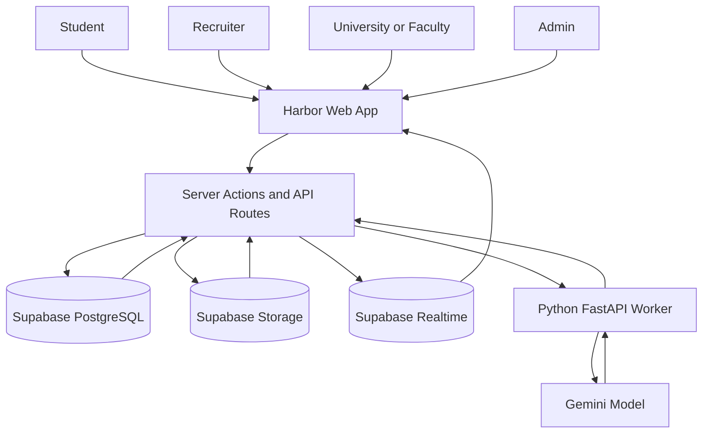
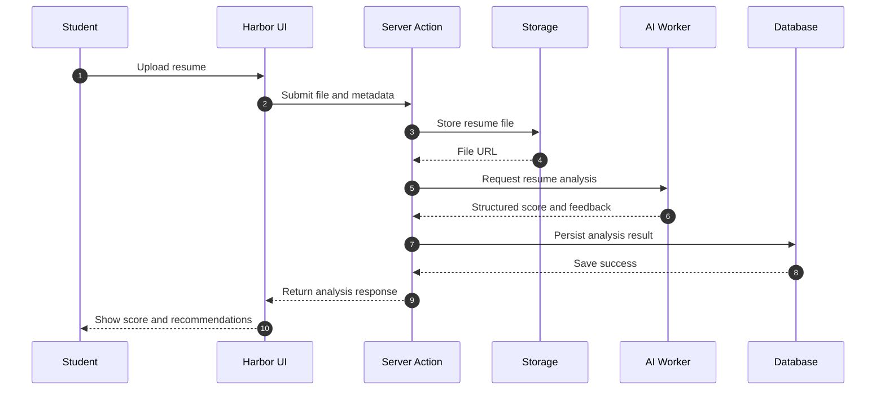
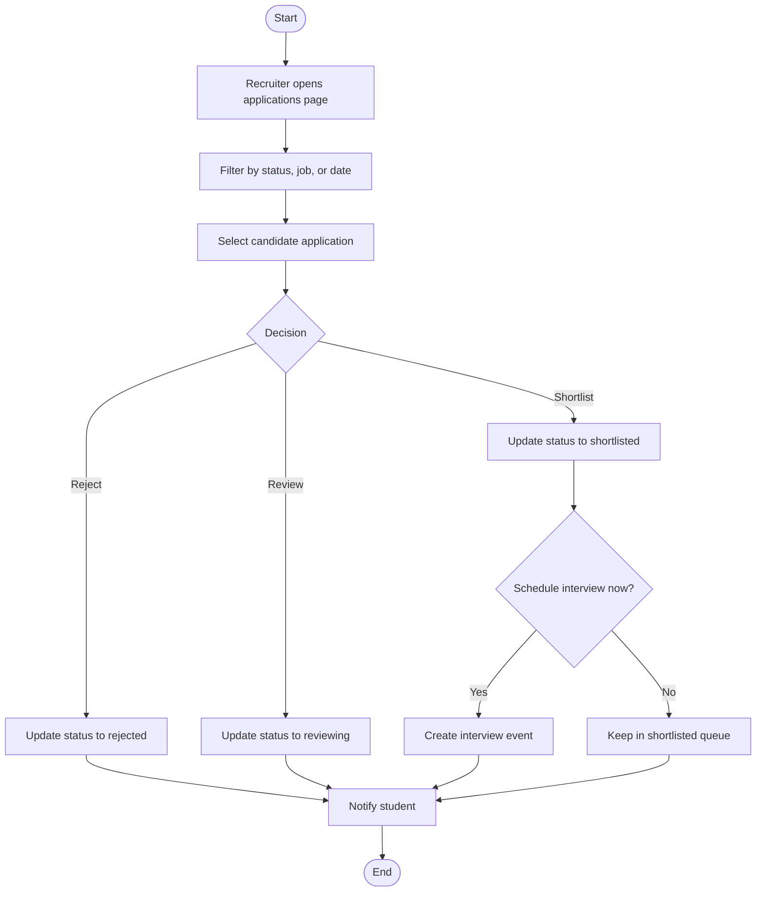
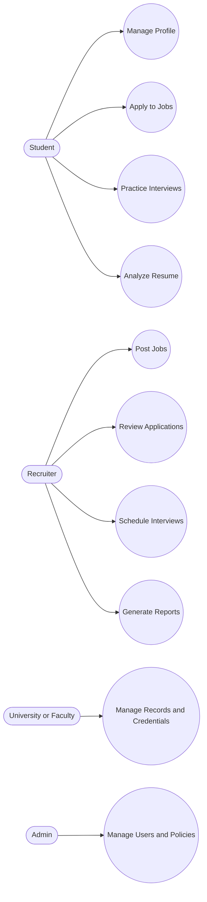
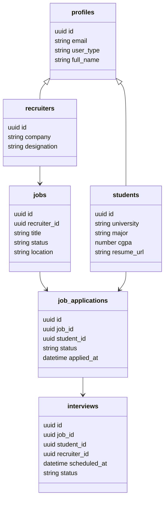

# HARBOR
## Unified Employability, Academic Progress, and Recruitment Platform

### Project Report

Submitted in partial fulfillment of the requirements for the award of the degree of
Bachelor of Technology / Bachelor of Engineering

in

Computer Science and Engineering

Submitted by:

- Student Name 1 - Enrollment No.
- Student Name 2 - Enrollment No.
- Student Name 3 - Enrollment No.
- Student Name 4 - Enrollment No.

Under the guidance of:

- Guide Name, Designation

Department of Computer Science and Engineering
Institute Name
Academic Year 2025-26

---

## CERTIFICATE

This is to certify that the project report entitled Harbor: Unified Employability, Academic Progress, and Recruitment Platform is a bona fide work carried out by the above-mentioned students under my supervision and guidance in partial fulfillment of the requirements for the award of the degree of Bachelor of Technology / Bachelor of Engineering in Computer Science and Engineering.

The work presented in this report is original and has not been submitted, either in part or full, to any other university or institution for the award of any degree or diploma.

Place:

Date:

Guide Signature:

Head of Department Signature:

---

## ACKNOWLEDGEMENT

We express our sincere gratitude to our project guide for continuous guidance, technical support, and constructive feedback throughout the development of Harbor. Their mentorship helped us approach this project with both engineering discipline and practical product thinking.

We are also thankful to the Head of Department and faculty members for providing the academic environment, infrastructure, and encouragement necessary to complete this work.

Finally, we thank our peers, family members, and well-wishers for their motivation and support during all stages of the project.

---

## ABSTRACT

Harbor is a full-stack, role-based platform designed to bridge the gap between academic progress, student employability, and recruiter hiring workflows. Most existing systems operate in isolation: students build resumes in one tool, recruiters track applications in another, and universities maintain records in separate portals. This fragmentation reduces visibility, slows decision-making, and weakens trust in candidate readiness signals.

The proposed system unifies three core ecosystems in one architecture: student career development, institutional academic management, and recruiter pipeline operations. Harbor provides role-specific dashboards, profile and credential management, job posting and application workflows, interview scheduling, reporting, and real-time notifications. It also integrates AI-powered resume analysis and interview preparation modules for practical readiness improvement.

The implementation uses Next.js, React, TypeScript, and Supabase for application and data services, along with a Python FastAPI worker for AI processing. Security is enforced through layered authorization and database Row Level Security policies. Performance improvements include server-side data loading, scoped caching, and query optimizations for recruiter analytics and dashboards.

Harbor demonstrates a production-oriented academic solution that is technically robust, extensible, and suitable for real institutional deployment with phased enhancements.

---

## CONTENTS

| Sr. No. | Title |
|---|---|
| I | Certificate |
| II | Acknowledgement |
| III | Abstract |
| IV | Contents |
| 1 | Chapter 1: Introduction and Objectives |
| 2 | Chapter 2: System Analysis |
| 3 | Chapter 3: System Design |
| 4 | Chapter 4: Tools and Technologies |
| 5 | Chapter 5: API and Backend Design |
| 6 | Chapter 6: Coding and Implementation |
| 7 | Chapter 7: Coding Standards and Quality Assurance |
| 8 | Chapter 8: Testing and Validation |
| 9 | Chapter 9: Results and Discussion |
| 10 | Chapter 10: Security Measures |
| 11 | Chapter 11: Cost Estimation |
| 12 | Chapter 12: Future Scope and Enhancements |
| 13 | Chapter 13: Bibliography |
| 14 | Chapter 14: Glossary |
| 15 | Chapter 15: Conclusion |

---

# CHAPTER 1
# INTRODUCTION AND OBJECTIVES

## 1.1 Project Overview

Harbor is a unified employability platform that connects students, recruiters, and universities in one digital workflow. The platform addresses a practical need in campus hiring: academic records, professional skills, resumes, interview preparation, and job pipelines should not exist in disconnected systems.

## 1.2 Problem Statement

Traditional campus placement processes are affected by:

- Siloed systems for profile building, applications, and interviews
- Limited recruiter visibility into verified student readiness
- Weak linkage between academic data and hiring decisions
- Manual coordination for interviews, status updates, and reporting

These issues reduce efficiency, increase turnaround time, and create inconsistency in candidate evaluation.

## 1.3 Objectives

The primary objectives of Harbor are:

- To build a multi-role platform for students, recruiters, and university stakeholders.
- To provide an end-to-end recruitment lifecycle from job posting to interview scheduling.
- To integrate AI-assisted resume analysis for profile quality improvement.
- To offer structured interview preparation with persistence and feedback analytics.
- To connect academic achievements, Credentials, and credentials to employability outcomes.
- To enforce secure and scalable data access with role-based controls and RLS.

## 1.4 User Roles

- Student: Manages profile, resumes, applications, and interview practice.
- Recruiter: Creates jobs, reviews applications, schedules interviews, and generates reports.
- University Admin and Faculty: Manages records, course-related data, and credential-linked progression.
- System Admin: Supervises overall platform usage, users, and operations.

## 1.5 Scope

Current scope includes web-based role dashboards, profile and file workflows, hiring modules, AI readiness modules, and analytics/reporting. Native mobile apps and advanced enterprise provisioning are considered future work.

---

# CHAPTER 2
# SYSTEM ANALYSIS

## 2a. Identification of Need

Campus employability systems require a common digital layer where all stakeholders can collaborate with trusted and current data. Harbor is designed to reduce friction between academic preparation and hiring execution.

## 2b. Preliminary Investigation

Initial analysis of existing tools showed that many platforms provide partial solutions but not a complete integrated model. Common gaps observed:

- Resume tools with no recruiter pipeline integration
- Job boards with weak university context
- Interview practice tools without measurable progression persistence
- Credential evidence managed outside recruiter workflows

## 2c. Feasibility Study

### Technical Feasibility

High feasibility due to mature frameworks, cloud database services, and modular full-stack architecture.

### Operational Feasibility

Role-specific UI and structured workflows make daily operations practical for all stakeholders.

### Economic Feasibility

The system can be developed and demonstrated in an academic setup with low infrastructure cost using managed service tiers and controlled API usage.

## 2d. Project Planning

| Phase | Activities | Duration |
|---|---|---|
| Phase 1 | Requirement gathering and architecture planning | 2 Weeks |
| Phase 2 | Database and authentication foundations | 2 Weeks |
| Phase 3 | Student and recruiter core workflow implementation | 3 Weeks |
| Phase 4 | University/faculty modules and credential flows | 2 Weeks |
| Phase 5 | AI modules (resume and interview prep) | 2 Weeks |
| Phase 6 | Testing, optimization, and security hardening | 2 Weeks |

## 2e. Software Requirement Specification (SRS)

### Functional Requirements

- FR01: The system shall support authenticated role-based access.
- FR02: Students shall be able to build and update profiles.
- FR03: Recruiters shall be able to create and manage jobs.
- FR04: Students shall be able to apply to jobs and track status.
- FR05: Recruiters shall be able to update application states.
- FR06: Recruiters shall be able to schedule, reschedule, and cancel interviews.
- FR07: The platform shall support resume upload and AI-based analysis.
- FR08: The platform shall support interview question practice and answer evaluation.
- FR09: The platform shall provide report exports and report history.
- FR10: The system shall provide real-time notifications for workflow events.

### Non-Functional Requirements

- NFR01: Sensitive operations shall enforce authorization server-side.
- NFR02: Database access shall use Row Level Security policies.
- NFR03: The UI shall be responsive across desktop and mobile form factors.
- NFR04: The system shall provide graceful fallback for delayed AI responses.
- NFR05: Dashboard and recruiter queries shall be optimized for practical response times.

## 2f. Software Engineering Paradigm

Harbor follows an incremental and modular development model. The project began with authentication and data foundations, then expanded to role workflows, followed by AI modules and hardening stages.

## 2g. Data Models and Use Case Summary

### High-Level Architecture

- Presentation Layer: Next.js frontend with role-based route groups
- Application Layer: Server actions and API routes
- Data Layer: Supabase PostgreSQL, Auth, Storage, Realtime
- AI Layer: Python FastAPI worker with Gemini-powered analysis and evaluation

### Use Case Summary

| Actor | Use Case | Description |
|---|---|---|
| Student | Apply for Job | Submit application and track status changes |
| Student | Resume Analysis | Upload resume and view AI recommendations |
| Student | Interview Practice | Attempt questions, receive evaluation, track performance |
| Recruiter | Manage Jobs | Create and maintain job postings |
| Recruiter | Review Applications | Move candidates through hiring pipeline |
| Recruiter | Schedule Interviews | Plan interview events for eligible candidates |
| University/Faculty | Manage Records | Track academic progression and related outcomes |
| Admin | Manage Platform | Monitor users and system-level workflows |

---

# CHAPTER 3
# SYSTEM DESIGN

## 3a. Modularization Details

| Module | Area | Responsibility |
|---|---|---|
| Authentication Module | Auth and profiles | Login, session, role context |
| Student Module | Student routes | Dashboard, profile, jobs, applications, prep |
| Recruiter Module | Recruiter routes | Jobs, applications, interviews, reports |
| University Module | University routes | Academic and institutional workflows |
| Notification Module | Shared services | Event alerts and unread state |
| Resume Module | Student AI workflow | File upload and analysis rendering |
| Interview Prep Module | Student AI workflow | Question bank, evaluator, sessions, analytics |
| Reporting Module | Recruiter operations | CSV/Excel/PDF generation and history |

## 3b. Database Design

### Core Tables

| Table | Purpose |
|---|---|
| profiles | Primary user metadata |
| students | Student-specific attributes |
| recruiters | Recruiter and company details |
| universities | Institutional metadata |
| jobs | Recruitment opportunities |
| job_applications | Candidate-job relationship with status |
| interviews | Interview scheduling records |
| notifications | In-app event stream |

### Interview and Readiness Tables

| Table | Purpose |
|---|---|
| questions | Tagged interview question bank |
| mock_sessions | Persisted interview practice sessions |
| bookmarks | Saved interview questions |
| practiced | Practice history and score trends |

## 3c. User Interface Design

Key design choices:

- Clear role separation for navigation and dashboards
- Task-oriented layouts for student and recruiter workflows
- Consistent forms and status-driven interaction patterns
- Real-time indicators for actionable events
- Responsive UI implemented with utility-first CSS

## 3d. Test Case Design

| Test Case ID | Scenario | Expected Result |
|---|---|---|
| TC01 | Student applies to job | Application stored with pending status |
| TC02 | Recruiter updates application | Status updated and visible across views |
| TC03 | Recruiter schedules interview | Interview record created successfully |
| TC04 | Resume upload invalid file | Validation blocks upload |
| TC05 | AI evaluator timeout | User receives fallback-safe response |
| TC06 | Unauthorized mutation attempt | Operation denied |
| TC07 | Bookmark question | Bookmark persisted and retrievable |
| TC08 | Report generation empty dataset | File generated with valid empty-state structure |
| TC09 | Realtime notification event | Unread counter updates without manual refresh |
| TC10 | Cross-role data access attempt | Blocked by policy checks |

## 3e. Diagrams

The following are the diagrams for the Harbor project.

### 3e.1 Data Flow Diagram

### 3e.2 Sequence Diagram

### 3e.3 Activity Diagram

### 3e.4 Use Case Diagram

### 3e.5 Data Dictionary Diagram

Data dictionary summary table:

| Entity | Key Fields | Description |
|---|---|---|
| profiles | id, email, user_type, full_name | Master identity and role context for all users |
| students | id, major, cgpa, resume_url | Student-specific academic and employability data |
| recruiters | id, company, designation | Recruiter profile and organization context |
| jobs | id, recruiter_id, title, status | Job postings created by recruiters |
| job_applications | id, job_id, student_id, status | Candidate progression for each applied job |
| interviews | id, job_id, student_id, scheduled_at | Interview scheduling and tracking records |

### 3e.6 Static Diagram Image Files (for PDF Submission)

- Data Flow: [PNG](diagrams/data-flow.png), [SVG](diagrams/data-flow.svg)
- Sequence: [PNG](diagrams/sequence-resume-analysis.png), [SVG](diagrams/sequence-resume-analysis.svg)
- Activity: [PNG](diagrams/activity-recruiter-review.png), [SVG](diagrams/activity-recruiter-review.svg)
- Use Case: [PNG](diagrams/use-case.png), [SVG](diagrams/use-case.svg)
- Data Dictionary: [PNG](diagrams/data-dictionary.png), [SVG](diagrams/data-dictionary.svg)

---

# CHAPTER 4
# TOOLS AND TECHNOLOGIES

## 4.1 Frontend Technologies

| Tool/Framework | Role |
|---|---|
| Next.js | Full-stack React framework |
| React | UI component model |
| TypeScript | Type safety and maintainability |
| Tailwind CSS | Styling and responsiveness |
| Radix UI | Accessible UI primitives |
| TanStack Query | Data synchronization patterns |

## 4.2 Backend and Data Technologies

| Tool/Framework | Role |
|---|---|
| Supabase Auth | Authentication services |
| Supabase PostgreSQL | Relational database |
| Supabase Storage | Resume/avatar/credential storage |
| Supabase Realtime | Live event updates |

## 4.3 AI and Processing Technologies

| Tool/Framework | Role |
|---|---|
| FastAPI | AI worker endpoints |
| Gemini API | NLP-based scoring and feedback |
| Structured JSON schema output | Deterministic AI response handling |

## 4.4 Development and Testing Tooling

- ESLint
- Jest and React Testing Library
- Playwright automation scripts
- Concurrent local dev scripts for multi-service runtime

---

# CHAPTER 5
# API AND BACKEND DESIGN

## 5.1 Backend Approach

Harbor uses server actions for business mutations and API routes for integration-focused operations. This separation keeps core domain updates secure and predictable while enabling external-service orchestration.

## 5.2 Representative Backend Capabilities

- Profile and role context resolution
- Job and application lifecycle operations
- Interview schedule operations with ownership validation
- Resume analysis trigger and persistence
- Interview answer evaluation and personalized question generation
- Recruiter report generation and history persistence

## 5.3 Data Access Pattern

- Read operations optimized and grouped by module scope
- Write operations protected by role and ownership verification
- Company-aware recruiter scoping used for analytics consistency

---

# CHAPTER 6
# CODING AND IMPLEMENTATION

## 6a. Student Workflow Implementation

Student workflows include profile management, job applications, resume analysis, and interview preparation. Each user action is validated server-side and persisted with role-aware constraints.

## 6b. Recruiter Workflow Implementation

Recruiters can create and manage jobs, process applications, shortlist candidates, and schedule interviews. Reporting supports CSV, Excel, and PDF exports for operational decision support.

## 6c. Interview Preparation Implementation

Interview preparation was implemented as a dedicated subsystem with four major pages:

- Mock Interview
- Question Bank
- Answer Evaluator
- Performance Tracker

Session outcomes are persisted, enabling trend analysis and weak-topic identification.

## 6d. Resume Analysis Implementation

Resume files are uploaded to secure storage, then analyzed by the AI worker. The system stores score and structured suggestions, and the frontend handles delayed responses through polling and retry logic.

## 6e. Realtime and Notifications

Realtime updates provide improved user responsiveness for notification and recruiter-facing activity views.

---

# CHAPTER 7
# CODING STANDARDS AND QUALITY ASSURANCE

## 7a. Code Organization Standards

- Module-specific separation of reads, writes, and utility logic
- Typed interfaces and predictable payload structures
- Reusable helper functions for auth and date/time transformations

## 7b. Validation and Error Handling

- Defensive input checks for critical mutations
- Ownership and role validation on server side
- Structured error pathways for user-safe messages
- Fallback handling for AI timeout and service errors

## 7c. Maintainability Practices

- Route-group based structure for role separation
- Naming consistency across modules
- Documented migration and setup steps for database and storage

---

# CHAPTER 8
# TESTING AND VALIDATION

## 8a. Testing Strategy

Testing included:

- End-to-end flow validation for student and recruiter paths
- Role-based access testing for protected actions
- Database policy validation for data isolation
- File upload edge-case tests
- AI response reliability checks under non-ideal conditions

## 8b. Testing Plan

| Level | Focus |
|---|---|
| Unit/Module | Mutation validation, helper correctness |
| Integration | UI, server action, and database interaction |
| System | Complete role journeys from login to task completion |

## 8c. Debugging and Improvement Highlights

- Resolved local build instability by enforcing clean build workflows.
- Corrected recruiter analytics inconsistencies through unified company-aware scoping.
- Hardened report generation to support empty-state exports safely.
- Improved authorization by deriving identity from authenticated server profile.

---

# CHAPTER 9
# RESULTS AND DISCUSSION

## 9.1 Achieved Outcomes

Harbor successfully demonstrates:

- Unified student-recruiter-university workflow integration
- AI-supported readiness features in practical user journeys
- Scalable and secure data model with policy-backed access control
- Operational recruiter tooling with interviews and reporting

## 9.2 Observed Benefits

- Reduced fragmentation across placement lifecycle stages
- Better recruiter visibility into candidate progression
- More actionable student feedback through AI and practice analytics
- Stronger data trust through role and policy enforcement

## 9.3 Viva-Ready Technical Highlights

Key discussion points for evaluation:

- Why a role-based architecture was selected
- How RLS complements application-layer authorization
- Why interview prep persistence matters for measurable readiness
- How structured AI outputs reduce unreliable parsing behavior
- How company-aware scoping improved recruiter analytics integrity

---

# CHAPTER 10
# SECURITY MEASURES

## 10a. Application Security

- Authenticated route guards and role checks on protected paths
- Server-side ownership verification for critical mutations
- Restricted integration endpoints for sensitive actions

## 10b. Database Security

- Row Level Security policies for own-data and scoped access
- Role-aware controls on report history and sensitive tables
- Policy-backed defense against cross-role unauthorized access

## 10c. File and Integration Security

- Controlled storage access for resumes and credentials
- Upload validation for type and size
- Replay-aware token handling in integration flows

---

# CHAPTER 11
# COST ESTIMATION

## 11.1 Development Cost Overview

| Resource | Academic Project Estimate |
|---|---|
| Frontend stack | Open-source framework usage |
| Backend and database services | Managed cloud tier usage |
| AI services | Controlled API usage costs |
| Hosting | Low-cost student/developer tiers |

## 11.2 Production Cost Drivers

- Number of active users
- Volume of uploaded documents
- AI request throughput
- Reporting and retention needs

---

# CHAPTER 12
# FUTURE SCOPE AND ENHANCEMENTS

Planned enhancement directions:

- Stronger saved-jobs and personalized recommendation pipelines
- Queue-backed AI processing for horizontal scale
- Expanded interview prep modules and adaptive learning plans
- Advanced observability with tracing and alerting
- Compliance-grade data governance workflows
- Cleaner multi-organization tenancy model

---

# CHAPTER 13
# BIBLIOGRAPHY

1. Next.js Documentation - https://nextjs.org/docs
2. React Documentation - https://react.dev
3. TypeScript Documentation - https://www.typescriptlang.org/docs
4. Supabase Documentation - https://supabase.com/docs
5. PostgreSQL Documentation - https://www.postgresql.org/docs
6. FastAPI Documentation - https://fastapi.tiangolo.com
7. Google AI Documentation - https://ai.google.dev
8. Tailwind CSS Documentation - https://tailwindcss.com/docs
9. PostgreSQL Row Level Security - https://www.postgresql.org/docs/current/ddl-rowsecurity.html

---

# CHAPTER 14
# GLOSSARY

| Term | Definition |
|---|---|
| RLS | Row Level Security; per-row authorization in PostgreSQL |
| ATS | Applicant Tracking System used in hiring pipelines |
| Server Action | Server-executed application function in Next.js architecture |
| Realtime | Event-driven UI update model |
| Role-Based Access Control | Authorization method based on user roles |
| Mock Session | Simulated interview session with stored evaluation data |
| Multi-Tenant | One platform serving multiple organizations securely |

---

# CHAPTER 15
# CONCLUSION

Harbor fulfills the core objective of creating a unified campus employability ecosystem by integrating student readiness, institutional context, and recruiter operations in one system. The platform demonstrates technical depth through modular architecture, strong authorization, policy-backed data controls, AI integration, and operational reporting.

From an academic perspective, Harbor is a complete and high-quality implementation aligned with software engineering best practices. From an industry perspective, it provides a scalable foundation for deployment-ready evolution.

In summary, Harbor is both a successful final-year project and a practical reference model for building secure, intelligent, and workflow-centric education-to-employment platforms.

---

## Appendix A: Viva Preparation Notes

### A.1 One-Minute Project Pitch

Harbor is a role-based full-stack platform that unifies student preparation, recruiter hiring, and university academic workflows. It combines job pipelines, interview scheduling, credential-linked visibility, and AI-powered readiness features in one secure architecture using Next.js, Supabase, and a FastAPI AI worker.

### A.2 Common Viva Questions and Strong Answer Direction

1. Why did you choose Supabase?
   - It provided integrated Auth, PostgreSQL, Storage, and Realtime with policy-level security support.

2. How is your platform secure?
   - Layered route and server authorization plus database RLS policies for row-level enforcement.

3. How did you integrate AI safely?
   - Structured JSON outputs, retry handling, and fallback-safe UI behavior.

4. What makes your architecture scalable?
   - Modular route groups, separated domain actions, managed database services, and independent AI worker.

5. What is your strongest contribution?
   - End-to-end integration of academics, employability, and hiring operations with measurable readiness workflows.

