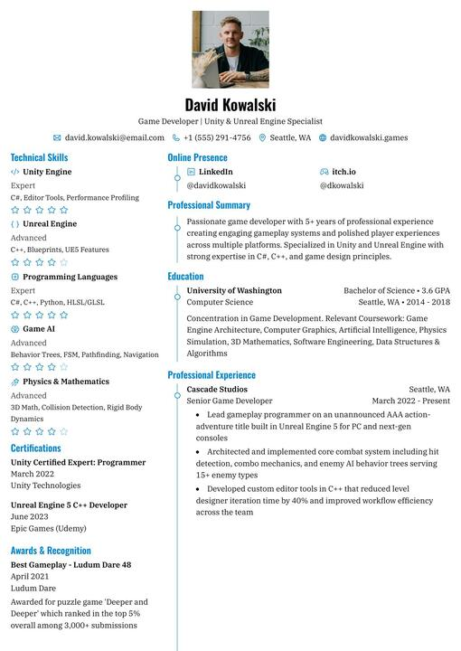
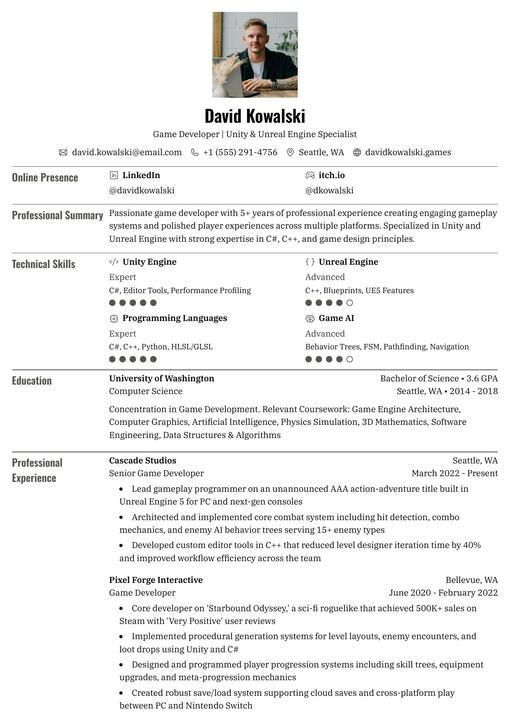
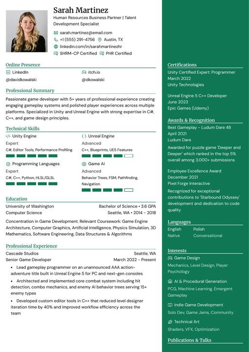
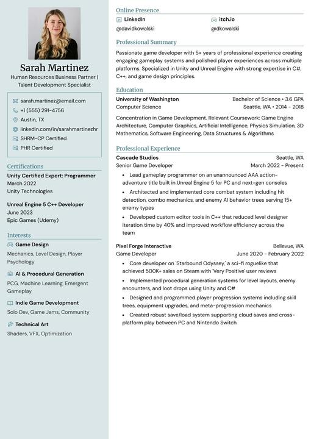
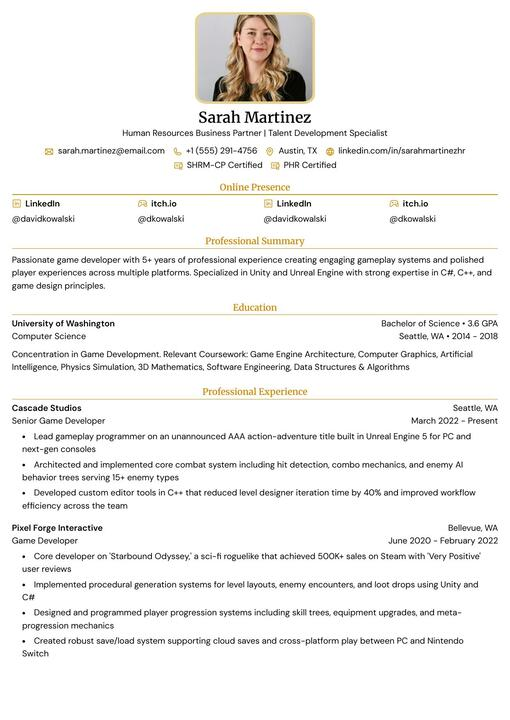

# ⚓ Harbor Resume Builder

<div align="center">
  

  <p align="center">
    <strong>A professional, real-time, and privacy-focused resume builder integrated into the Harbor ecosystem.</strong>
  </p>

  <p align="center">
    
    
    
    
    
    
  </p>

  <p align="center">
    <a href="#-features">Features</a> •
    <a href="#-templates">Templates</a> •
    <a href="#-tech-stack">Tech Stack</a> •
    <a href="#-getting-started">Getting Started</a> •
    <a href="#-privacy">Privacy</a>
  </p>
</div>

---

## 🎯 Features

**Harbor Resume Builder** simplifies the process of creating, updating, and sharing your professional story.

### 🏗️ Resume Building
- **Real-time Preview:** See your resume evolve instantly as you type.
- **Drag-and-Drop:** Easily reorder sections to highlight your strongest assets.
- **Rich Text Editing:** Full control over formatting with an intuitive editor.
- **Custom Sections:** Add unique content types tailored to your specific career path.

### 🎨 Design & Templates
- **Professional Templates:** Choose from 12+ industry-standard templates.
- **Total Customization:** Adjust colors, fonts, spacing, and layouts with a few clicks.
- **Advanced Styling:** Use custom CSS to fine-tune every pixel.
- **Multiple Sizes:** Full support for both A4 and Letter page formats.

### 📤 Export & Import
- **High-Quality PDF:** Export your resume as a clean, ATS-friendly PDF.
- **JSON Export/Import:** Full ownership of your data—export to JSON and import it back anytime.
- **Third-party Import:** Bring in data from LinkedIn or other JSON Resume formats.

---

## 🖼️ Templates

<table>
  <tr>
    <td align="center"><br /><sub><b>Azurill</b></sub></td>
    <td align="center"><br /><sub><b>Bronzor</b></sub></td>
    <td align="center"><br /><sub><b>Chikorita</b></sub></td>
    <td align="center"><br /><sub><b>Ditto</b></sub></td>
  </tr>
  <tr>
    <td align="center"><br /><sub><b>Gengar</b></sub></td>
    <td align="center"><br /><sub><b>Glalie</b></sub></td>
    <td align="center"><br /><sub><b>Kakuna</b></sub></td>
    <td align="center"><br /><sub><b>Lapras</b></sub></td>
  </tr>
</table>

---

## 🛠️ Tech Stack

| Category | Technology |
| :--- | :--- |
| **Framework** | TanStack Start (React 19, Vite) |
| **API** | ORPC (Type-safe RPC) |
| **Auth** | Better Auth (Integrated with Harbor SSO) |
| **Styling** | Tailwind CSS |
| **UI Components** | Radix UI & Base UI |
| **State** | Zustand & TanStack Query |
| **Database** | PostgreSQL (Supabase) with Drizzle ORM |

---

## 🚀 Getting Started

Harbor Resume Builder is designed to run as part of the broader **Harbor** ecosystem.

### Prerequisites
- **Node.js** ≥ 18.x
- **pnpm** (preferred) or npm

### Installation
1.  Navigate to the directory:
    ```bash
    cd reactive_resume
    ```
2.  Install dependencies:
    ```bash
    corepack pnpm install
    ```
3.  Set up your environment variables (copy `.env.example` to `.env`).
4.  Start the development server:
    ```bash
    npm run dev
    ```

The builder will be accessible at `http://localhost:3001`.

---

## 🛡️ Privacy & Security

We believe your career data is your own. 
- **No Tracking:** We don't use ads or invasive analytics.
- **Complete Ownership:** You can delete your account and all associated data permanently with one click.
- **Self-Hostable:** Built with architectural patterns that allow for independent deployment.

---

## 🤝 Attribution

This tool is built upon the foundation of an open-source project, [Reactive Resume](https://github.com/amruthpillai/reactive-resume). We have integrated and rebranded it to serve the students within the **Harbor** platform.

---

<div align="center">
  <b>⚓ Harbor Resume</b><br />
  <i>Empowering your professional journey.</i>
</div>
